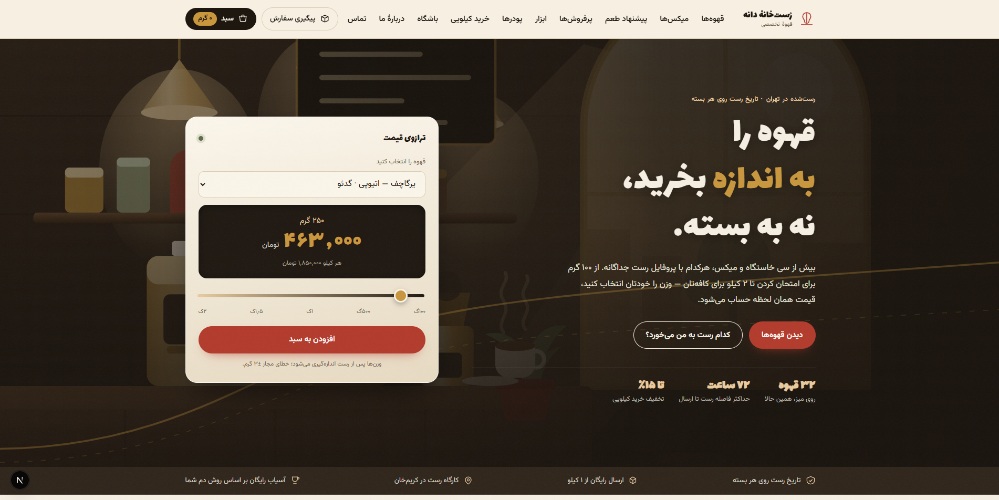
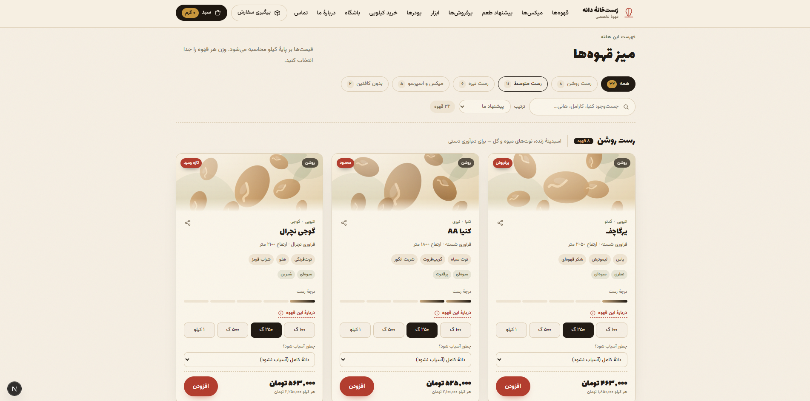
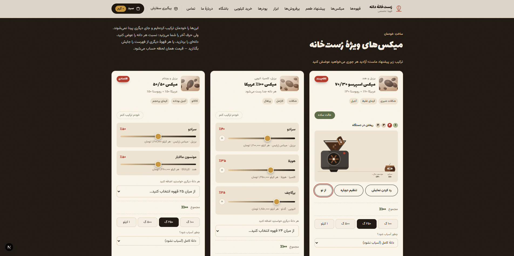
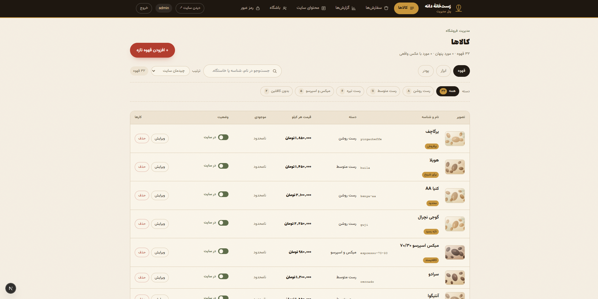

# رست‌خانهٔ دانه (Roasthouse Daneh)

[**فارسی**](#فارسی) · [English](#english)

---

## فارسی

<div dir="rtl">

فروشگاه اینترنتی و پنل مدیریت یک رست‌خانهٔ قهوهٔ تخصصی. قهوه و پودر **وزنی**
فروخته می‌شوند — به گرم، با نرخ هر کیلو — و ابزار **عددی**. مشتری می‌تواند میکس
خودش را با اهرم بسازد؛ قیمت هر کیلو همان لحظه از میانگین وزنی دانه‌هایی که
برداشته حساب می‌شود.

تمام رابط کاربری فارسی و راست‌به‌چپ است. در این پروژه نه UI kit هست، نه
CSS framework، نه کتابخانهٔ state، نه کتابخانهٔ نمودار، نه بستهٔ تقویم شمسی و نه
TypeScript. تقویم شمسی، بازه‌بندی گزارش‌ها، تصویرسازی کالاها و استایل‌نامهٔ
راست‌به‌چپ همه دست‌نویس‌اند، و این انتخاب از سر بی‌حوصلگی نبوده — دلیلش در
بخش تصمیم‌های مهندسی آمده.

### تصویرها

#### فروشگاه

**صفحهٔ اصلی.** بالای صفحه خلاصهٔ کل مدل فروش است: یک قهوه انتخاب کنید، وزن را
از ۱۰۰ گرم تا ۲ کیلو بکشید، و قیمت همان‌طور که می‌کشید از نرخ هر کیلو دوباره
حساب می‌شود. کل رابط، از یک استایل‌نامه و بدون هیچ مرحلهٔ آینه‌کاری، فارسی و
راست‌به‌چپ است.



**فهرست کالاها.** چیپ‌های فیلتر درجهٔ رست شمار خودشان را همراه دارند، و تا وقتی
هیچ فیلتری فعال نشده فهرست بر اساس درجهٔ رست گروه‌بندی می‌ماند. وزن و آسیاب روی
خود کارت انتخاب می‌شوند، پس یک قهوه آسیاب‌شده برای اسپرسو به سبد می‌رود و قهوهٔ
بعدی دانه‌درسته. تصویر هر دانه یک SVG است که از دادهٔ خود کالا ساخته می‌شود —
فروشگاه تازه عکسی ندارد و تنها جانشین دیگرش قاب‌های خالی بود.



**ساز میکس.** هر دو حالت در یک قاب پیداست: دو کارت در حالت اهرمی‌اند و کارت سوم
وسط ریختن است، در حالت تصویری، جایی که گونی‌ها مرحله‌به‌مرحله داخل قیف خالی
می‌شوند. حالت تصویری پیاده‌سازی موازی نیست — هیچ حالتی از خودش نگه نمی‌دارد،
همان آرایهٔ `mix` را می‌گیرد، همان `applyPercent` را صدا می‌زند و از همان
`addWeighed` بیرون می‌آید. میکسی که با اهرم ساخته شود و همان میکس که در حالت
تصویری ریخته شود، ردیف سبدی بایت‌به‌بایت یکسان می‌دهند؛ و دلیل اینکه
`mixSignature` و `buildLine` به‌جای ماندن در کانتکست ری‌اکت در
`web/src/lib/cartLine.js` نشسته‌اند همین است: تست می‌تواند هر دو راه را به آن
برساند. پس عوض کردن حالت وسط کار چیزی را از دست نمی‌دهد، و با
`prefers-reduced-motion` هیچ تایمری اجرا نمی‌شود و یک کلیک یک‌راست به کیسهٔ آماده
می‌رسد.



#### پنل مدیریت

**کالاها.** همان واژگان فیلتر و جست‌وجو و مرتب‌سازی فروشگاه، به‌علاوهٔ موجودی و
یک کلید روشن و خاموش برای هر کالا. خاموش کردن یک کالا آن را هم از فهرست
برمی‌دارد، هم از `sitemap.xml`، و هم از آدرس خودش — که از آن به بعد ۴۰۴ واقعی با
`noindex` می‌دهد، نه تغییر مسیر.



**کالای تازه.** قاب پیش‌نمایش ماکت کارت نیست؛ همان `ItemCard` واقعی فروشگاه است
که زنده روی حالت فرم سوار شده. به همین دلیل است که پنل مدیریت فهرست کالاها را در
مرورگر می‌گیرد نه روی سرور. نوشتن اسلاگ انگلیسی هم همان چیزی است که تصویرسازی
خودکار را راه می‌اندازد، پس نقاشی پیش از ذخیره شدن پیدا می‌شود.


**گزارش‌ها.** بازه‌بندی روزانه و هفتگی و ماهانه و سالانه، روی همان تقویمی که
فروشنده با آن کار می‌کند: هفته از شنبه شروع می‌شود، و اختلاف وقت تهران در لحظهٔ
دقیق هر سفارش پرسیده می‌شود نه اینکه ثابت فرض شود — چون ایران در ۱۴۰۱ ساعت
تابستانی را برداشت و سفارش‌های قدیمی‌تر با <code dir="ltr">+04:30</code> ثبت شده‌اند. ریاضی تاریخ،
نوارهای سهم و خروجی‌های استریمی CSV و JSON همه دست‌نویس‌اند: نه بستهٔ تقویم، نه
کتابخانهٔ نمودار.


### پشتهٔ فناوری

| لایه | انتخاب |
| --- | --- |
| پایگاه داده | MongoDB 8 + Mongoose 8 |
| API | Express 4، سراسر ESM |
| احراز هویت | JSON Web Token + bcrypt، فقط برای مدیر |
| آپلود | multer، نام تصادفی، سقف ۴ مگابایت |
| فشرده‌سازی | compression روی همهٔ پاسخ‌های API |
| سخت‌سازی | helmet روی API، CSP با nonce روی صفحه‌ها، cors، express-rate-limit |
| رابط کاربری | Next.js 16 (App Router) + React 19 |
| فونت | next/font — میزبانی روی دامنهٔ خودمان، دریافت موقع build |
| تست | Vitest — ۳۸۰ تست، بدون نیاز به پایگاه داده |
| لینت و قالب‌بندی | ESLint 9 (flat config) + Prettier |
| CI | GitHub Actions — نصب، لینت، قالب‌بندی، تست، build |

نیازمند Node 22 به بالا. بدون TypeScript، بدون کتابخانهٔ state، بدون UI kit،
بدون CSS framework، بدون کتابخانهٔ تاریخ شمسی، بدون کتابخانهٔ نمودار و بدون
کتابخانهٔ سئو — همه دست‌نویس.

### معماری

</div>

<div dir="ltr">

```
shared/           npm workspace — the code both sides must agree on
  pricing.js        tiers, shipping, rounding, blend maths
  taxonomy.js       the allowed keys (kinds, groups, shapes, tastes, grinds)
  seo.js            product URLs, page titles, JSON-LD, sitemap, robots

server/           Express + Mongoose, port 4000 — API only, serves no HTML
  src/index.js      app assembly, compression, security headers, error mapping
  src/models/       Item · Order · Admin · ClubMember · Content
  src/routes/       auth · items · orders · content · club · stats · reports · seo
  src/lib/          jalali.js · stock.js · track.js · cors.js · siteUrl.js · upload.js
  src/middleware/   auth.js (JWT guard) · rateLimit.js (login · order · track)

web/              Next.js App Router, port 3000 (proxies /api and /uploads to :4000)
  src/proxy.js      per-request nonce CSP and the other security headers
  src/app/          the route table *is* the folder tree
                      layout.jsx        rtl shell, self-hosted fonts, modal slot
                      page.jsx          home — reads the catalogue on the server
                      coffee|gear|powder/[slug]/   product pages, one implementation
                      @modal/           intercepting routes: the product modal
                      track/            public order lookup
                      admin/            login outside the gate, eight screens inside
  src/context/      ShopContext (catalogue + cart) · AuthContext (admin session)
  src/lib/          data.js (server reads) · metadata.js · cartStorage.js
                    art.js (generated SVG) · blend.js · blendVisual.js
                    cartLine.js · groups.js · format.js · seo.js
  src/components/   storefront, both blend-builder modes, and admin/

tests/            Vitest, run from the repo root against all three workspaces
docs/             design notes, data model, algorithms, known weaknesses (Persian)
```

</div>

<div dir="rtl">

**یک مدل برای سه نوع کالا.** قهوه و ابزار و پودر هر سه در یک سند `Item` می‌نشینند
و با فیلد `kind` از هم جدا می‌شوند. قاعده‌هایی که به نوع کالا وابسته‌اند — کدام
گروه‌ها مجازند، کدام کلیدهای تصویرسازی به کار می‌آیند، و اینکه کالا آسیاب‌شدنی
هست یا نه — به‌جای پخش شدن در سه مدل، در یک قلاب <code dir="ltr">pre('validate')</code> جمع شده‌اند.
نتیجه‌اش این است که از پنل مدیریت و مسیر API و کارت کالا هم فقط یکی داریم.

**مرورگر هیچ تصمیم مهمی نمی‌گیرد.** قیمت را برای نمایش حساب می‌کند، ولی موقع ثبت
سفارش هر قیمتی روی سرور از نو حساب می‌شود، و هر نوشتنی از پنل مدیریت از یک فهرست
سفید صریح رد می‌شود.

### تصمیم‌های مهندسی

#### بازمحاسبهٔ قیمت روی سرور

مسیر `POST /api/orders` هر عددی را که مرورگر فرستاده نادیده می‌گیرد. هر کالا — و
هر دانهٔ داخل هر میکس سفارشی — را دوباره از پایگاه داده می‌خواند، آسیاب و درصدهای
میکس و وزن‌ها را از نو اعتبارسنجی می‌کند و جمع‌ها را از صفر حساب می‌کند. بدنهٔ
درخواست فقط خواسته را می‌رساند — کدام اسلاگ، چند گرم، چه ترکیبی — و هیچ‌وقت پول.

پله‌های تخفیف (۵ درصد از یک کیلو، ۱۰ درصد از سه کیلو، ۱۵ درصد از پنج کیلو، فقط
روی کالای وزنی) و آستانهٔ ارسال رایگان در `shared/pricing.js` نشسته‌اند و هر دو
طرف همان را import می‌کنند. این ماژول روزگاری در دو طرف تکرار شده بود و با دست
هماهنگ نگه داشته می‌شد؛ دو نسخه می‌توانستند از هم دور بیفتند و آن‌وقت به مشتری یک
عدد گفته می‌شد و عدد دیگری ثبت — بدون اینکه هیچ خطایی جایی بالا بیاید. حالا یک
بستهٔ workspace است، پس واگرایی چیزی نیست که تشخیصش بدهیم؛ چیزی است که نمی‌تواند
رخ بدهد.

#### سفارش، عکس لحظه‌ای است نه ارجاع

هر ردیف سفارش `name` و `unitPrice` و `lineTotal` و برچسب آسیاب و ترکیب کامل میکس
را با نام دانه‌ها در خودش ذخیره می‌کند، نه فقط اسلاگی که به `Item` امروز اشاره
کند. گران شدن یک قهوه در هفتهٔ آینده نباید بی‌صدا فاکتور هفتهٔ پیش را بازنویسی
کند، و حذف دانه‌ای که دیگر نمی‌آوریم نباید سفارش قدیمی را به `undefined` تبدیل
کند. رسیدی هم که به مشتری برمی‌گردد به همین دلیل از روی سفارش ذخیره‌شده خوانده
می‌شود.

#### رزرو اتمی موجودی

مقدار `Item.stock` اگر `null` باشد یعنی نامحدود — که پیش‌فرض است، پس هیچ داده‌ای
لازم نبود مهاجرت کند — وگرنه یک عدد است. رزرو کردن برای هر ردیف یک به‌روزرسانی
شرطی است:

</div>

<div dir="ltr">

```js
Item.findOneAndUpdate(
  { slug, stock: { $gte: need } },
  { $inc: { stock: -need } },
  { new: true }
);
```

</div>

<div dir="rtl">

شرط و کم کردن هر دو داخل قفل یک سند رخ می‌دهند، پس دو مشتری که سر آخرین ۵۰۰ گرم
با هم مسابقه می‌دهند نمی‌توانند هر دو برنده شوند: یکی قهوه را می‌گیرد و آن یکی
۴۰۹ و یک توضیح فارسی. هیچ تراکنشی در کار نیست، و این مهم است چون مونگوی تک‌نودی
تراکنش ندارد.

چون هر ردیف جدا رزرو می‌شود، سفارش چندردیفی می‌تواند سر ردیف سوم شکست بخورد در
حالی که دو ردیف پیشین از موجودی کم شده‌اند. برای همین هر رزرو موفق ثبت می‌شود و
اگر ردیف بعدی شکست بخورد — یا حتی اگر خود `Order.create` خطا بدهد — همه پس داده
می‌شوند. سفارش یا کامل ثبت می‌شود یا اصلا ثبت نمی‌شود.

#### پیگیری سفارش بدون حساب کاربری

مشتری حساب کاربری ندارد، پس بعد از بستن رسید هیچ راهی نداشت ببیند سفارشش کجاست.
مسیر `GET /api/orders/track` همان جفتی را می‌گیرد که مشتری از قبل در دست دارد —
شمارهٔ سفارش به‌علاوهٔ موبایلی که خودش داده — و سفارش را فقط وقتی برمی‌گرداند که
هر دو با هم جور باشند.

سه قاعده نمی‌گذارند این مسیر به یک پیش‌گو تبدیل شود:

- **یک جواب برای دو شکست.** شماره‌ای درست با موبایل غلط دقیقا همان چیزی را
  برمی‌گرداند که شماره‌ای ناموجود. وگرنه صفحه راهی می‌شود برای شمردن سفارش‌ها:
  شماره‌ها را امتحان کن، ببین کدام‌ها هستند، و از همان حجم فروش و نرخ رشد مغازه
  را دربیاور.
- **مقایسه در زمان ثابت.** اگر پاسخ برای شمارهٔ ناموجود زودتر برمی‌گشت، همان
  چیزی که پیام یکسان پنهانش می‌کند از راه زمان بیرون می‌زد. پس جست‌وجو همیشه یک
  مقایسه را اجرا می‌کند، و آن مقایسه اول هر دو طرف را هش می‌کند — چون
  `timingSafeEqual` روی طول‌های نابرابر خطا می‌دهد و خود آن خطا یک نشت است.
- **فهرست سفید صریح برای خروجی.** تابع `publicOrderView` پاسخ را فیلد به فیلد از
  نو می‌سازد، نه اینکه فیلدهای ناخواسته را حذف کند؛ پس هر فیلدی که فردا به مدل
  اضافه شود به‌طور پیش‌فرض بیرون می‌ماند. نشانی و شمارهٔ تماس و یادداشت مشتری
  به‌خواست خودمان حذف شده‌اند: دیدن وضعیت سفارش به نشانی احتیاج ندارد، و یک حدس
  خوش‌شانس نباید محل زندگی کسی را تحویل بدهد.

یک محدودکنندهٔ نرخ سوم هم از این مسیر نگهبانی می‌کند — دست‌ودل‌بازتر از
محدودکنندهٔ ثبت سفارش، چون مشتری واقعی ممکن است اشتباه تایپ کند، ولی تنگ‌تر از آن
که جاروب کردن فضای شماره‌ها به زحمتش بیارزد.

#### دو راه ساخت میکس، یک منطق

ساز میکس یک حالت اهرمی ساده دارد و یک حالت تصویری اختیاری که در آن گونی‌ها
مرحله‌به‌مرحله داخل قیف می‌ریزند. حالت تصویری هیچ حالتی از میکس را پیش خودش نگه
نمی‌دارد: همان آرایهٔ `mix` را می‌گیرد، همان `applyPercent` را صدا می‌زند و کار
را با همان `addWeighed` تمام می‌کند. پس جابه‌جا شدن بین دو حالت چیزی را از دست
نمی‌دهد، و میکسی که از هر کدام از این دو راه ساخته شود ردیف سبدی بایت‌به‌بایت
یکسان می‌دهد — و `mixSignature` و `buildLine` دقیقا برای اینکه بشود همین ادعا را
تست کرد از کانتکست ری‌اکت بیرون کشیده و در `web/src/lib/cartLine.js` گذاشته شدند.

آنچه به‌راستی مال حالت تصویری است فقط ریاضی نمایش است، که در `blendVisual.js`
خالص نگه داشته شده: یک بودجهٔ زمانی ثابت که به نسبت سهم بین گونی‌ها تقسیم می‌شود
(تا میکس هفت‌دانه‌ای سه برابر میکس دودانه‌ای طول نکشد)، سطح پر شدن قیف به‌شکل
درصد تجمعی، و هندسه‌ای که دهانهٔ هر گونی را بالای قیف نگه می‌دارد، هر اندازه هم
که گونی بزرگ کشیده شده باشد. جاوااسکریپت فقط مرز مرحله‌ها را علامت می‌زند؛ حرکت
بین آن‌ها با CSS است. با `prefers-reduced-motion` هیچ تایمری اجرا نمی‌شود و یک
کلیک یک‌راست به کیسهٔ آماده می‌رسد.

#### تقویم شمسی دست‌نویس

گزارش‌ها روزانه و هفتگی و ماهانه و سالانه بسته می‌شوند، روی همان تقویمی که
فروشنده واقعا با آن کار می‌کند: مرداد یعنی مرداد، نه آگوست، و هفته از شنبه شروع
می‌شود. همین یک بند برای برداشتن یک کتابخانه کافی بود. چیزی که نگذاشت، منطقهٔ
زمانی بود: ایران در ۱۴۰۱ ساعت تابستانی را برداشت، پس اختلاف امروز <code dir="ltr">+03:30</code> است —
ولی سفارش‌های پیش از آن با <code dir="ltr">+04:30</code> ثبت شده‌اند، و یک اختلاف ثابت بعضی‌شان را در
روز اشتباه می‌نشاند. فایل `server/src/lib/jalali.js` به‌جای فرض کردن یک عدد ثابت،
اختلاف واقعی را در همان لحظهٔ مشخص از `Intl` می‌پرسد و بعد تبدیل می‌کند. حدود
۲۸۰ خط است، بدون هیچ وابستگی، و روی همان مرزهایی تست شده که واقعا می‌شکنند:
نوروز، سال کبیسه، شروع هفته، و زمان‌های دوران ساعت تابستانی.

#### تصویرسازی خودکار کالاها

فروشگاه تازه عکس ندارد. به‌جای فرستادن قاب‌های خالی، فایل `web/src/lib/art.js`
هر کالا را به‌شکل یک SVG از روی دادهٔ خودش می‌کشد: رنگ دانه از درجهٔ رست (۱ تا ۵)
می‌آید، پالت پس‌زمینه از دسته، و پخش‌وپلا شدن دانه‌ها از یک مولد شبه‌تصادفی که
دانه‌اش اسلاگ کالاست — پس تصویر هر کالا تا ابد ثابت می‌ماند و هیچ دو کالایی شبیه
هم درنمی‌آیند. ابزار و پودر واژگان شکلی خودشان را دارند (۳۶ شکل ابزار، ۱۴ شکل
پودر، ۱۶ تن رنگ) که از فهرست‌های کشویی پنل انتخاب می‌شوند، و آن فهرست‌ها از همان
کلیدهایی ساخته می‌شوند که سرور با آن‌ها اعتبارسنجی می‌کند. آپلود یک عکس واقعی
جای نقاشی را می‌گیرد.

#### چند نکته که ارزش نگاه دوم را دارند

- **جلوگیری از تزریق فرمول در CSV** — سلول‌هایی که با <code dir="ltr">= + - @</code> شروع می‌شوند در
  خروجی یک آپاستروف می‌گیرند، چون نشانی‌هایی که مشتری نوشته سر از فایلی
  درمی‌آورند که اکسل با کمال میل فرمول حسابشان می‌کند. خروجی‌ها UTF-8 با BOM اند
  تا فارسی درست باز شود.
- **خروجی استریمی** — پشتیبان CSV و JSON از روی کرسر مونگو استریم می‌شوند، نه
  اینکه آرایه در حافظه ساخته شود.
- **باطل کردن توکن** — توکن یک `tokenVersion` با خودش دارد؛ عوض کردن رمز مدیر
  آن را یک واحد جلو می‌برد و همهٔ نشست‌های باز می‌میرند.
- **محدودیت نرخی که پشت پراکسی هم واقعا کار کند** — گزینهٔ `trust proxy` فقط در
  تولید یا با یک پرچم صریح روشن می‌شود، چون روشن کردن بی‌قیدوشرطش به هر کلاینتی
  اجازه می‌دهد `X-Forwarded-For` جعلی بفرستد و از محدودیت رد شود، و نگذاشتنش پشت
  nginx همهٔ بازدیدکننده‌ها را در یک سطل مشترک می‌ریزد.
- **CORS با صدای بلند شکست می‌خورد** — نبودن `CLIENT_ORIGIN` در تولید پروسه را
  می‌بندد، نه اینکه به «هر مبدایی مجاز است» برگردد.
- **آپلودها دو بار قفل شده‌اند** — یکی اینکه SVG در فهرست MIME پذیرفته‌شده نیست
  (سندی XML است که می‌تواند <code dir="ltr">&lt;script&gt;</code> حمل کند و از مبدا خود فروشگاه سرو می‌شود)،
  و دیگر اینکه پاسخ‌های <code dir="ltr">/uploads</code> با `nosniff` و یک CSP از جنس
  `default-src 'none'; sandbox` و دانلود اجباری برای پسوندهای سندمانند می‌آیند —
  پس فایل‌هایی هم که پیش از این قاعده آپلود شده‌اند نمی‌توانند اجرا شوند.
- **SVG ساخته‌شده سر منبع escape می‌شود** — فایل `art.js` رشته‌ای برمی‌گرداند که
  ری‌اکت عینا تزریقش می‌کند، پس هر نامی که مدیر نوشته پیش از رسیدن به
  `aria-label` از <code dir="ltr">esc()</code> رد می‌شود. یک دسته تست هر چهار مولد را با نام‌های
  خصمانه می‌سنجد، و یک تست هم خود سنجنده را می‌سنجد.
- **ویژگی‌های منطقی CSS** — یعنی `inset-inline-start` و `margin-block-end` و
  `padding-inline`. یک استایل‌نامه، بدون هیچ مرحلهٔ آینه‌کاری برای راست‌به‌چپ.
- **پیام خطای فارسی در همهٔ لایه‌ها**، از اعتبارسنج‌های Mongoose تا رابط کاربری.
  خروجی کنسول انگلیسی می‌ماند، چون ترمینال ویندوز فارسی را <code dir="ltr">?</code> چاپ می‌کند.

### اجرا روی سیستم خودتان

نیازمند Node 22 به بالا و یک MongoDB روشن روی `localhost:27017`.

</div>

<div dir="ltr">

```bash
git clone <repo> && cd Ghahve
cp server/.env.example server/.env
cp web/.env.example web/.env.local
npm run setup
npm run dev
```

</div>

<div dir="rtl">

در فایل `server/.env` حتما `JWT_SECRET` را عوض کنید. فایل `web/.env.local` در
حالت توسعه اختیاری است. دستور `npm run setup` هر سه workspace را نصب و بعد
پایگاه داده را seed می‌کند، و `npm run dev` هم API را روی ۴۰۰۰ و Next را روی
۳۰۰۰ بالا می‌آورد.

| نشانی | چیست |
| --- | --- |
| `http://localhost:3000` | فروشگاه |
| `http://localhost:3000/admin` | پنل مدیریت |
| `http://localhost:3000/track` | پیگیری سفارش |
| `http://localhost:4000/api` | API |

مرورگر فقط با Next حرف می‌زند و Next مسیرهای <code dir="ltr">/api</code> و <code dir="ltr">/uploads</code> و
<code dir="ltr">/sitemap.xml</code> و <code dir="ltr">/robots.txt</code> را به Express می‌فرستد؛ پس یک مبدا بیشتر در کار
نیست و در توسعه مسئلهٔ CORS پیش نمی‌آید.

عملیات seed صد و شش کالا، محتوای پیش‌فرض سایت و حساب مدیر اولیه را از روی
`server/.env` می‌سازد.

| دستور | کارش |
| --- | --- |
| `npm run dev` | API و Next با هم |
| `npm run build` | ساخت نسخهٔ تولید در `web/.next` (برای فونت‌ها به شبکه نیاز دارد) |
| `npm start` | هر دو پروسه در حالت تولید |
| `npm run seed` | هرچه نیست اضافه می‌کند، به آنچه هست دست نمی‌زند |
| `npm run seed:reset` | پایگاه داده را می‌ریزد و از نو می‌سازد |
| `npm run lint` | ESLint |
| `npm run format` | Prettier، با نوشتن |
| `npm test` | Vitest، یک بار |

این پروژه یک workspace از نوع npm است: یک `npm install` در ریشه هر سه بستهٔ
`shared` و `server` و `web` را پوشش می‌دهد و فقط یک `package-lock.json` داریم.

### متغیرهای محیطی

همه سمت سرورند، در `server/.env` (نمونه‌اش `server/.env.example` است):

| متغیر | پیش‌فرض | توضیح |
| --- | --- | --- |
| `PORT` | `4000` | |
| `MONGODB_URI` | `mongodb://127.0.0.1:27017/ghahve` | برای اطلس بدون تغییر دیگری همین را عوض کنید |
| `JWT_SECRET` | — | **اجباری**؛ پیش از انتشار عوضش کنید |
| `TOKEN_HOURS` | `12` | عمر نشست مدیر |
| `ADMIN_USERNAME` / `ADMIN_PASSWORD` | `admin`، رمز بدون پیش‌فرض | فقط یک بار، سر اولین seed |
| `CLIENT_ORIGIN` | — | مبدأهای مجاز، جدا با کاما. **در تولید اجباری** — سرور به‌جای باز گذاشتن همه‌چیز، بدون آن اصلا بالا نمی‌آید |
| `RATE_LIMIT_LOGIN_MAX` / <code dir="ltr">_WINDOW_MIN</code> | `5/15` | ۵ تلاش ورود در هر ۱۵ دقیقه، به ازای هر IP |
| `RATE_LIMIT_ORDER_MAX` / <code dir="ltr">_WINDOW_MIN</code> | `5/60` | ۵ سفارش در هر ۶۰ دقیقه، به ازای هر IP |
| `RATE_LIMIT_TRACK_MAX` / <code dir="ltr">_WINDOW_MIN</code> | `20/15` | ۲۰ پیگیری در هر ۱۵ دقیقه، به ازای هر IP |
| `RATE_LIMIT_DISABLED` | تنظیم‌نشده | فقط برای آزمایش دستی؛ در `NODE_ENV=test` همیشه خاموش |
| `TRUST_PROXY` | تنظیم‌نشده | پشت nginx یا کلادفلر `1` بگذارید؛ در `NODE_ENV=production` خودبه‌خود روشن است |

فایل `server/.env` در <code dir="ltr">.gitignore</code> است.

### تست‌ها

</div>

<div dir="ltr">

```bash
npm test
npm run test:watch
```

</div>

<div dir="rtl">

سیصد و هشتاد تست، بدون پایگاه داده و بدون مرورگر واقعی — هرچه تست می‌شود یا تابع
خالص است، یا ماژولی که وابستگی‌اش تزریق شده، یا (در سه فایل) کامپوننتی که در
jsdom رندر می‌شود. پوشش تست‌ها به‌خواست خودمان روی منطقی متمرکز است که یک جواب
غلط و بی‌صدا در آن پول آب می‌کند:

| فایل | چه چیزی را میخکوب می‌کند |
| --- | --- |
| `tests/pricing.test.js` | مرز پله‌ها (۹۹۹ گرم در برابر ۱۰۰۰ گرم)، تخفیف فقط روی کالای وزنی، گرد کردن، میانگین وزنی میکس، آستانه‌های ارسال |
| `tests/blend.test.js` | ثابت اهرم: مشتری هر کاری بکند، جمع درصدها دقیقا ۱۰۰ می‌ماند |
| `tests/jalali.test.js` | تبدیل میلادی و شمسی، شروع هفته از شنبه، نوروز و سال کبیسه، سری بازه‌ها |
| `tests/stock.test.js` | قرارداد رزرو، از جمله پس دادن کامل وقتی ردیف بعدی شکست می‌خورد — روی مدلی قلابی که فیلتر و به‌روزرسانی اتمی مونگو را تقلید می‌کند |
| `tests/taxonomy.test.js` | هر کلید shared دقیقا یک برچسب فارسی دارد، و ترتیب‌های رابط کاربری خود آرایه‌های shared اند نه کپی‌شان |
| `tests/cors.test.js` | تولید بدون `CLIENT_ORIGIN` خطا می‌دهد و باز نمی‌شود |
| `tests/rate-limit.test.js` | محدودکننده‌ها زیر `NODE_ENV=test` خاموش‌اند، پس هیچ‌وقت یک دستهٔ بی‌ربط را لرزان نمی‌کنند |
| `tests/track.test.js` | موبایل غلط از شمارهٔ ناموجود قابل تشخیص نیست، هنجارسازی شماره و موبایل، و اینکه نمای عمومی هیچ‌وقت فیلدی را که فردا به مدل اضافه شود لو نمی‌دهد |
| `tests/upload.test.js` | SVG پذیرفته نمی‌شود، هدرهای <code dir="ltr">/uploads</code> گذاشته می‌شوند، و عکس‌های معمولی هنوز به دانلود اجباری نمی‌افتند |
| `tests/card-art.test.js` | نام خصمانهٔ کالا نمی‌تواند به تگ <code dir="ltr">&lt;svg&gt;</code> صفتی اضافه کند یا ببنددش — به‌علاوهٔ یک فراتست که خود سنجنده دندان دارد |
| `tests/blend-visual.test.js` | بودجهٔ ریختن دقیقا خرج می‌شود، سطح قیف سهم تجمعی را دنبال می‌کند، و دهانهٔ هر گونی روی قیف می‌نشیند |
| `tests/cart-hydration.test.jsx` | سبد ذخیره‌شده از یک چرخهٔ کامل رندر سرور و hydrate سالم بیرون می‌آید: HTML سرور ادعای سبد نمی‌کند، حافظه هیچ‌وقت با <code dir="ltr">[]</code> بازنویسی نمی‌شود، و فهرست ناقص کالا نمی‌تواند بی‌صدا ردیفی را از سفارش بیندازد |
| `tests/cart-storage.test.js` | سبد ذخیره‌شده به‌جای اینکه باور شود از نو اعتبارسنجی می‌شود، و حافظهٔ خصمانه یا نبود حافظه نمی‌تواند فروشگاه را بشکند |
| `tests/next-metadata.test.js` | هر تگی که `headTags` تعریف می‌کند هنوز به شیء metadata نکست می‌رسد |
| `tests/next-routes.test.js` | هر نوع کالا پوشهٔ مسیر واقعی دارد، در هر دو جهت — چون App Router نمی‌تواند آن‌ها را از taxonomy بسازد |
| `tests/item-card.test.jsx` | هر نوع کالا یک <code dir="ltr">&lt;a href&gt;</code> واقعی به صفحهٔ خودش رندر می‌کند، با متن و بی‌متن |
| `tests/item-detail.test.jsx` | مودال کالا بیرون از `ShopProvider` هم رندر می‌شود — پرکاربردترین راه دیدن کالا نباید به کانتکست گره بخورد |

روی هر push و هر pull request، مسیر CI به‌ترتیب نصب و لینت و بررسی قالب‌بندی و
تست و build را اجرا می‌کند.

### محدودیت‌های شناخته‌شده

صادقانه و از سر انتخاب، با استدلال و راه‌حل پیشنهادی که در
[`docs/11-weaknesses.md`](docs/11-weaknesses.md) نوشته شده: درگاه پرداخت نداریم
(سفارش‌ها با تماس تلفنی تأیید می‌شوند)، حساب کاربری مشتری نداریم (فقط همان صفحهٔ
پیگیری با جفت شماره و موبایل) و تأیید پیامکی هم نداریم. محدودکننده‌های نرخ در
حافظهٔ همان پروسه می‌شمارند، پس استقرار چندپروسه‌ای به یک انبارهٔ مشترک نیاز
دارد. موجودی میکس روی خود کالای میکس نگه داشته می‌شود نه از دانه‌های اجزایش، پس
بهتر است میکس‌ها نامحدود بمانند.

همان سند این را هم ثبت می‌کند که چه چیزی درست شده و چه چیزی نه، و پای هر مورد
نوشته که در عمل چه چیزی تحویل داده شد و کجا با پیشنهاد اولیه فرق کرد — از جمله
مورد ۲۶، که تصمیم اولیه به رندر نکردن روی سرور، کنار استدلالی که بعدا برش
گرداند، روی پرونده مانده است.

### مطالعهٔ بیشتر

پوشهٔ <code dir="ltr">docs/</code> یک نوشتهٔ کامل فارسی دربارهٔ پروژه است — معماری، مدل داده،
الگوریتم‌ها، سیستم طراحی، استدلال پشت هر تصمیم، و فهرستی بی‌رودربایستی از
ضعف‌ها. فایل [`docs/README-fa.md`](docs/README-fa.md) هم راهنمای اپراتور است،
برای کسی که واقعا مغازه را می‌گرداند.

</div>

---

## English

[↑ بازگشت به نسخهٔ فارسی](#فارسی)

A production-oriented storefront and admin panel for a Persian specialty coffee
roastery. Coffee and powders are sold **by weight** (per gram, priced per kilo),
gear is sold **by unit**, and customers can build their own blend with a slider —
the price per kilo is recalculated live from the weighted average of the beans
they picked.

The whole interface is Persian and right-to-left. There is no UI kit, no CSS
framework, no state library, no charting library, no Jalali-calendar package and
no TypeScript. The Jalali calendar, the reporting buckets, the product artwork
and the RTL stylesheet are all written from scratch, on purpose — see
[Engineering decisions](#engineering-decisions).

### Screenshots

#### Storefront

**Home.** The hero is the whole buying model in miniature: choose a coffee, drag
the weight anywhere from 100 g to 2 kg, and the price is recalculated from the
per-kilo rate as you drag. The interface is Persian and right-to-left
throughout, from one stylesheet with no mirroring pass.


**Catalogue.** Roast-level filter chips carry their own counts, and with no
filter applied the list stays grouped by roast. Weight and grind are chosen per
card, so one coffee goes into the cart ground for espresso and the next as whole
bean. Every bean illustration is SVG generated from the product's own data — a
new shop has no photographs, and placeholder boxes were the alternative.


**Blend builder.** Both modes are visible in one shot: the two cards on the left
are in slider mode, and the card on the right is mid-pour in the visual mode,
where sacks tip into the hopper one stage at a time. The visual mode is not a
parallel implementation — it holds no blend state of its own, receives the same
`mix` array, calls the same `applyPercent`, and finishes through the same
`addWeighed`. A blend dragged together with sliders and the same blend poured in
the visual mode produce a byte-identical cart line, which is why `mixSignature`
and `buildLine` live in `web/src/lib/cartLine.js` rather than inside the React
context: a test can hold both paths to it. Switching modes mid-blend therefore
loses nothing, and under `prefers-reduced-motion` no timers run at all — one
click goes straight to the finished bag. See
[Two ways to build a blend, one set of logic](#two-ways-to-build-a-blend-one-set-of-logic).


#### Admin panel

**Products.** The same filter, search and sort vocabulary as the storefront,
plus stock and a per-item on/off switch. Switching an item off pulls it from the
catalogue, from `sitemap.xml`, and from its own URL, which then returns a real
404 with `noindex` rather than a redirect.


**New product.** The pane on the left is not a mockup of the card — it is the
storefront's own `ItemCard` component, mounted live against the form state. That
is the reason the admin panel loads the catalogue in the browser rather than on
the server. Typing the English slug is also what seeds the generated artwork,
so the drawing appears before anything is saved.


**Reports.** Buckets by day, week, month and year in the Jalali calendar the
shop owner actually uses — Saturday week starts, and Tehran's offset resolved at
each specific instant rather than assumed constant, because Iran abolished DST
in 2022 and older orders were recorded at `+04:30`. The date maths, the share
bars and the streamed CSV/JSON exports are all hand-written: no calendar
package, no charting library.


### Tech stack

| Layer         | Choice                                       |
| ------------- | -------------------------------------------- |
| Database      | MongoDB 8 + Mongoose 8                       |
| API           | Express 4, ESM throughout                    |
| Auth          | JSON Web Tokens + bcrypt, admin-only         |
| Uploads       | multer, random filenames, 4 MB cap           |
| Compression   | compression (gzip on every API response)      |
| Hardening     | helmet on the API, nonce CSP on pages, cors, express-rate-limit |
| UI            | Next.js 16 (App Router) + React 19           |
| Fonts         | next/font — self-hosted, fetched at build time |
| Tests         | Vitest (380 tests, no database required)     |
| Lint / format | ESLint 9 (flat config) + Prettier            |
| CI            | GitHub Actions — install, lint, format, test, build |

Node 22+. No TypeScript, no state library, no UI kit, no CSS framework, no
Jalali-date library, no charting library, no SEO library — all hand-written.

### Architecture

```
shared/           npm workspace — the code both sides must agree on
  pricing.js        tiers, shipping, rounding, blend maths
  taxonomy.js       the allowed keys (kinds, groups, shapes, tastes, grinds)

  seo.js            product URLs, page titles, JSON-LD, sitemap, robots

server/           Express + Mongoose, port 4000 — API only, serves no HTML
  src/index.js      app assembly, compression, security headers, error mapping
  src/models/       Item · Order · Admin · ClubMember · Content
  src/routes/       auth · items · orders · content · club · stats · reports · seo
  src/lib/          jalali.js · stock.js · track.js · cors.js · siteUrl.js · upload.js
  src/middleware/   auth.js (JWT guard) · rateLimit.js (login · order · track)

web/              Next.js App Router, port 3000 (proxies /api and /uploads to :4000)
  src/proxy.js      per-request nonce CSP and the other security headers
  src/app/          the route table *is* the folder tree
                      layout.jsx        rtl shell, self-hosted fonts, modal slot
                      page.jsx          home — reads the catalogue on the server
                      coffee|gear|powder/[slug]/   product pages, one implementation
                      @modal/           intercepting routes: the product modal
                      track/            public order lookup
                      admin/            login outside the gate, eight screens inside
  src/context/      ShopContext (catalogue + cart) · AuthContext (admin session)
  src/lib/          data.js (server reads) · metadata.js · cartStorage.js
                    art.js (generated SVG) · blend.js · blendVisual.js
                    cartLine.js · groups.js · format.js · seo.js
  src/components/   storefront, both blend-builder modes, and admin/

tests/            Vitest, run from the repo root against all three workspaces
docs/             design notes, data model, algorithms, known weaknesses (Persian)
```

**One model for three product types.** Coffee, gear and powder all live in a
single `Item` document discriminated by `kind`. The type-dependent rules
(which groups are valid, which artwork keys apply, whether it is grindable)
are concentrated in one `pre('validate')` hook rather than spread across three
models — so the admin panel, the API routes and the product card are also one
of each.

**The client never decides anything that matters.** It computes prices for
display, but every price is recomputed server-side at checkout, and every write
from the admin panel passes through an explicit whitelist.

### Engineering decisions

#### Server-side price recalculation

`POST /api/orders` ignores every number the browser sends. It re-reads each
item — and each bean inside each custom blend — from the database, revalidates
the grind, the blend percentages and the weights, and recomputes the totals
from scratch. The request body supplies intent (which slug, how many grams,
what mix), never money.

The tier discounts (5% from 1kg, 10% from 3kg, 15% from 5kg, weighed goods
only) and the free-shipping threshold live in `shared/pricing.js`, which both
sides import. That module used to be duplicated on both sides,
kept in sync by hand; the two copies could drift and the customer would be
quoted one number while a different one was recorded, with no error anywhere.
It is now a single npm workspace package, so divergence is not something we
detect — it is something that cannot happen.

#### Orders are snapshots, not references

An order line stores `name`, `unitPrice`, `lineTotal`, the grind label and the
full blend composition with bean names — not just a slug pointing at the
current `Item`. Raising a coffee's price next week must not silently rewrite
last week's invoice, and deleting a discontinued bean must not turn an old
order into `undefined`. The receipt returned to the customer is read back out
of the saved order for the same reason.

#### Atomic stock reservation

`Item.stock` is `null` for unlimited (the default, so nothing needed
migrating), a number otherwise. Reserving is a single conditional update per
line:

```js
Item.findOneAndUpdate(
  { slug, stock: { $gte: need } },
  { $inc: { stock: -need } },
  { new: true }
);
```

The condition and the decrement happen inside one document lock, so two
customers racing for the last 500g cannot both win — one gets the coffee, the
other gets a 409 and a Persian explanation. No transactions are involved,
which matters because a single-node MongoDB does not offer them.

Because each line reserves separately, a multi-line order can fail on its third
line after two have already been decremented. Every successful reservation is
therefore recorded and released if any later line fails, or if `Order.create`
itself throws. An order is placed in full or not at all.

#### Order tracking without accounts

Customers have no login, so after closing the receipt they had no way to see
where their order was. `GET /api/orders/track` takes the pair the customer
already holds — order code plus the phone number they gave — and returns the
order only when both match.

Three rules keep that endpoint from becoming an oracle:

- **One answer for two failures.** A valid code with the wrong phone returns
  exactly what a nonexistent code returns. Otherwise the page becomes a way to
  enumerate orders: try codes, learn which ones exist, and from that the shop's
  volume and growth rate.
- **Constant-time comparison.** Returning faster for a missing code would leak
  through timing what the identical message hides, so the lookup always runs a
  comparison, and the comparison hashes both sides first — `timingSafeEqual`
  throws on unequal lengths, and that throw is itself a leak.
- **An explicit output whitelist.** `publicOrderView` rebuilds the response
  field by field rather than deleting unwanted ones, so any field added to the
  model later stays out by default. The delivery address, phone and customer
  note are deliberately excluded: seeing an order's status does not require the
  address, and a lucky guess should not hand over where someone lives.

A third rate limiter guards it — more generous than the order limiter, since a
real customer may mistype, but tight enough that scanning the code space is
not worth it.

#### Two ways to build a blend, one set of logic

The blend builder has a plain slider mode and an optional visual mode where
sacks tip into a hopper stage by stage. The visual mode holds no blend state of
its own: it receives the same `mix` array, calls the same `applyPercent`, and
finishes by calling the same `addWeighed`. Switching between modes therefore
loses nothing, and a blend built either way produces a byte-identical cart
line — `mixSignature` and `buildLine` were lifted out of the React context into
`web/src/lib/cartLine.js` precisely so that claim could be tested.

What is specific to the visual mode is only presentation maths, kept pure in
`blendVisual.js`: a fixed time budget split between sacks by share (so a
seven-bean blend does not take three times as long as a two-bean one), the
hopper fill level as a cumulative percentage, and the geometry that keeps each
sack's mouth over the hopper regardless of how large the sack is drawn.
JavaScript only marks the stage boundaries; the motion between them is CSS.
With `prefers-reduced-motion`, no timers run at all and one click goes straight
to the finished bag.

#### A hand-rolled Jalali calendar

Reports bucket by day, week, month and year in the calendar the shop owner
actually uses: مرداد means Mordad, not August, and the week starts on Saturday.
That alone would justify a library. The reason there isn't one is the time
zone: Iran abolished DST in 2022, so the offset is `+03:30` today — but orders
placed before that were at `+04:30`, and a fixed offset puts some of them in
the wrong day. `server/src/lib/jalali.js` asks `Intl` for the real offset at
each specific instant instead of assuming a constant, then converts. It is
~280 lines, dependency-free, and tested against the boundaries that actually
break: Nowruz, leap years, week starts, and DST-era timestamps.

#### Generated product artwork

A new shop has no photographs. Rather than ship placeholder boxes,
`web/src/lib/art.js` draws every product as an SVG derived from its own
data: the bean colour comes from the roast level (1–5), the background palette
from the category, and the scatter of beans from a seeded PRNG keyed on the
slug — so a product's artwork is stable forever, and no two products look
alike. Gear and powders get their own shape vocabulary (36 gear shapes, 14
powder shapes, 16 tones), picked from dropdowns in the admin panel that are
generated from the same key lists the server validates against. Uploading a
real photo replaces the drawing.

#### Details worth a second look

- **CSV injection guard** — exported cells starting with `= + - @` are prefixed
  with an apostrophe, since customer-written addresses land in a file that
  Excel will happily treat as formulas. Exports are UTF-8 with a BOM so Persian
  opens correctly.
- **Streamed exports** — CSV and JSON backups stream from a Mongo cursor rather
  than building the array in memory.
- **Token invalidation** — the JWT carries a `tokenVersion`; changing the admin
  password bumps it and every existing session dies.
- **Rate limiting that actually works behind a proxy** — `trust proxy` is
  enabled only in production or behind an explicit flag, because enabling it
  unconditionally lets any client forge `X-Forwarded-For` and walk around the
  limit, while omitting it behind nginx gives every visitor one shared bucket.
- **CORS fails loudly** — an unset `CLIENT_ORIGIN` in production exits the
  process instead of defaulting to "allow every origin".
- **Uploads are locked down twice** — SVG is not in the accepted MIME list (it
  is an XML document that can carry `<script>`, and it would be served from the
  shop's own origin), and `/uploads` responses carry `nosniff`, a
  `default-src 'none'; sandbox` CSP and forced download for document-like
  extensions, so files uploaded before that rule cannot execute either.
- **Generated SVG is escaped at the source** — `art.js` returns a string that
  React injects verbatim, so every admin-supplied name passes through `esc()`
  before it reaches an `aria-label`. A test suite checks all four generators
  with hostile names, and one test checks the checker.
- **Logical CSS properties** — `inset-inline-start`, `margin-block-end`,
  `padding-inline`. One stylesheet, no RTL mirroring pass.
- **Persian error messages at every layer**, from Mongoose validators to the UI.
  Console output stays English, because the Windows terminal renders Persian as
  `?`.

### Running locally

Requires Node 22+ and a running MongoDB on `localhost:27017`.

```bash
git clone <repo> && cd Ghahve
cp server/.env.example server/.env    # then edit JWT_SECRET
cp web/.env.example web/.env.local    # optional in development
npm run setup                         # installs all workspaces, then seeds
npm run dev                           # API on :4000, Next on :3000
```

| URL                            | What                                  |
| ------------------------------ | ------------------------------------- |
| `http://localhost:3000`        | storefront                            |
| `http://localhost:3000/admin`  | admin panel                           |
| `http://localhost:3000/track`  | public order tracking                 |
| `http://localhost:4000/api`    | API                                   |

The browser only ever talks to Next; Next forwards `/api`, `/uploads`,
`/sitemap.xml` and `/robots.txt` to Express, so there is one origin and no CORS
problem in development.

The seed creates 106 products, the default site content and the initial admin
account from `server/.env`.

| Script                | What it does                                            |
| --------------------- | ------------------------------------------------------- |
| `npm run dev`         | API and Next together                                   |
| `npm run build`       | production build into `web/.next` (needs network for fonts) |
| `npm start`           | both processes in production mode                       |
| `npm run seed`        | add anything missing, touch nothing existing            |
| `npm run seed:reset`  | drop and rebuild the database                           |
| `npm run lint`        | ESLint                                                  |
| `npm run format`      | Prettier, writing                                       |
| `npm test`            | Vitest, single run                                      |

This is an npm workspace: one `npm install` at the root covers `shared`,
`server` and `web`, and there is a single `package-lock.json`.

### Environment variables

All server-side, in `server/.env` (see `server/.env.example`):

| Variable | Default | Notes |
| --- | --- | --- |
| `PORT` | `4000` | |
| `MONGODB_URI` | `mongodb://127.0.0.1:27017/ghahve` | swap for an Atlas URI unchanged |
| `JWT_SECRET` | — | **required**; change it before deploying |
| `TOKEN_HOURS` | `12` | admin session lifetime |
| `ADMIN_USERNAME` / `ADMIN_PASSWORD` | `admin` / — | used once, at first seed |
| `CLIENT_ORIGIN` | — | comma-separated allowed origins. **Required in production** — the server refuses to start without it rather than allowing every origin |
| `RATE_LIMIT_LOGIN_MAX` / `_WINDOW_MIN` | `5` / `15` | login attempts per IP |
| `RATE_LIMIT_ORDER_MAX` / `_WINDOW_MIN` | `5` / `60` | orders per IP |
| `RATE_LIMIT_TRACK_MAX` / `_WINDOW_MIN` | `20` / `15` | order-tracking lookups per IP |
| `RATE_LIMIT_DISABLED` | unset | manual testing only; always off in `NODE_ENV=test` |
| `TRUST_PROXY` | unset | set to `1` behind nginx/Cloudflare; implied by `NODE_ENV=production` |

`server/.env` is gitignored.

### Tests

```bash
npm test          # single run
npm run test:watch
```

380 tests, no database and no real browser — everything under test is a pure
function, a module with its dependency injected, or (in three files) a component
rendered into jsdom. Coverage is deliberately aimed at the logic where a silent
wrong answer costs money:

| File | What it pins down |
| --- | --- |
| `tests/pricing.test.js` | tier boundaries (999g vs 1000g), discounts on weighed goods only, rounding, blend weighted averages, shipping thresholds |
| `tests/blend.test.js` | the slider invariant: whatever the customer does, the percentages still sum to exactly 100 |
| `tests/jalali.test.js` | Gregorian↔Jalali conversion, Saturday week starts, Nowruz and leap years, bucket series |
| `tests/stock.test.js` | the reservation contract, including full rollback when a later line fails — against a fake model that mimics Mongo's atomic filter-and-update |
| `tests/taxonomy.test.js` | every shared key has exactly one Persian label, and the UI orderings are the shared arrays rather than copies of them |
| `tests/cors.test.js` | production without `CLIENT_ORIGIN` throws instead of opening up |
| `tests/rate-limit.test.js` | limiters are disabled under `NODE_ENV=test`, so they can never make an unrelated suite flaky |
| `tests/track.test.js` | a wrong phone is indistinguishable from a missing code, phone/code normalisation, and that the public view never leaks a field the model gains later |
| `tests/upload.test.js` | SVG is not accepted, the `/uploads` headers are set, and ordinary images are still not forced to download |
| `tests/card-art.test.js` | hostile product names cannot add an attribute to the `<svg>` tag or close it — plus a meta-test that the checker itself has teeth |
| `tests/blend-visual.test.js` | the pour budget is spent exactly, the hopper level tracks cumulative share, and every sack's mouth lands on the hopper |
| `tests/cart-hydration.test.jsx` | a saved cart survives a full server-render → hydrate cycle: the server HTML claims no cart, storage is never overwritten with `[]`, and a partially-seeded catalogue cannot silently drop lines from an order |
| `tests/cart-storage.test.js` | the stored cart is re-validated rather than trusted, and a hostile or absent storage cannot break the shop |
| `tests/next-metadata.test.js` | every tag `headTags` defines still reaches Next's metadata object — the successor to the old server/browser head-parity test |
| `tests/next-routes.test.js` | every product kind has a real route folder, in both directions, since the App Router cannot generate them from taxonomy |
| `tests/item-card.test.jsx` | every kind of product renders a real `<a href>` to its own page, with and without prose |
| `tests/item-detail.test.jsx` | the product modal renders outside `ShopProvider` — the most-used way of viewing a product must not be tied to the context |

CI runs install → lint → format check → test → build on every push and pull
request.

### Known limitations

Honest and deliberate, with the reasoning and proposed fixes written up in
[`docs/11-weaknesses.md`](docs/11-weaknesses.md): there is no payment gateway
(orders are confirmed by phone), no customer accounts (only the code-plus-phone
tracking page) and no SMS verification. The rate limiters count in process memory,
so a multi-process deployment would need a shared store. Blend stock is tracked
on the blend item itself rather than drawn down from its component beans, so
blends are best left unlimited.

That document also records what has been fixed and what has not, each item
annotated with what actually shipped and how it differed from the original
proposal — including item 26, where the original decision *not* to server-render
is kept on the record next to the reasoning that later reversed it.

### Further reading

The `docs/` directory is a full Persian write-up of the project — architecture,
data model, algorithms, design system, the reasoning behind each decision, and
a candid list of weaknesses. [`docs/README-fa.md`](docs/README-fa.md) is the
Persian operator guide for whoever actually runs the shop.
